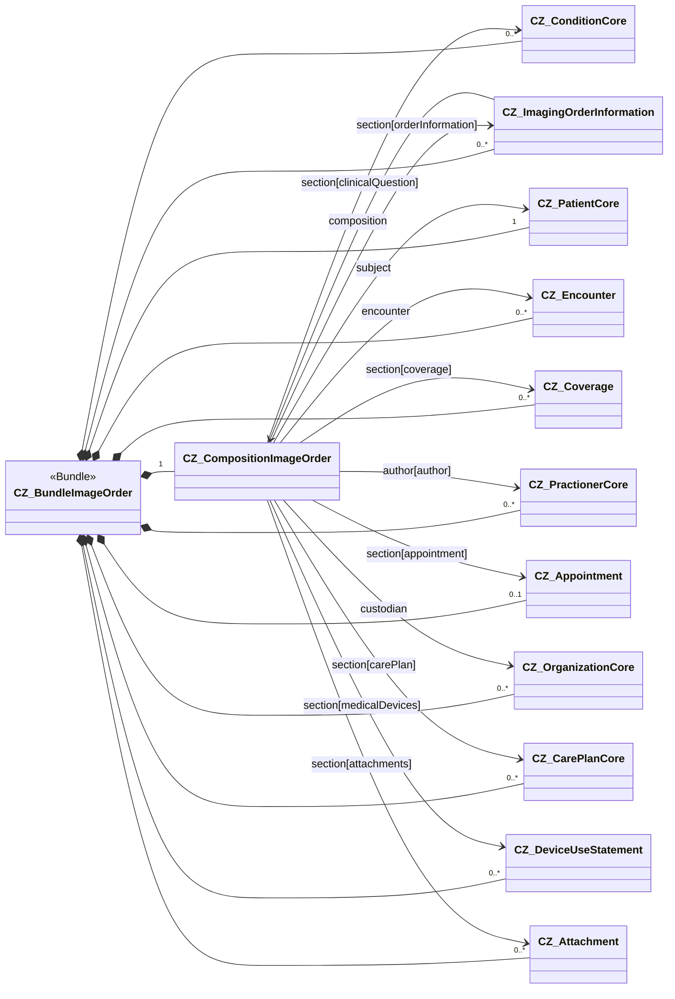

Tato stránka obsahuje poznámky k implementaci Žádanky o zobrazovací vyšetření. Týkají se sestavení FHIR Bundle a naplnění jeho profilů daty.

### Přehled

Žádanka o zobrazovací vyšetření je reprezentována jako FHIR Bundle, který obsahuje zdroj `CZ_CompositionImageOrder` a všechny zdroje ve stromové struktuře zdrojů, na které se odkazuje, viz [$document operation](https://www.hl7.org/fhir/composition-operation-document.html).

```mermaid
classDiagram
  direction LR
  class CZ_BundleImageOrder{
    <<Bundle>>
  }
  CZ_BundleImageOrder *-- "1" CZ_CompositionImageOrder
  CZ_BundleImageOrder *-- "1" CZ_PatientCore
  CZ_BundleImageOrder *-- "0..*" CZ_ImagingOrderInformation
  CZ_BundleImageOrder *-- "0..*" CZ_ConditionCore
  CZ_BundleImageOrder *-- "0..*" CZ_Coverage
  CZ_BundleImageOrder *-- "0..*" CZ_Encounter
  CZ_BundleImageOrder *-- "0..1" CZ_Appointment
  CZ_BundleImageOrder *-- "0..*" CZ_CarePlanCore
  CZ_BundleImageOrder *-- "0..*" CZ_PractionerCore
  CZ_BundleImageOrder *-- "0..*" CZ_OrganizationCore
  CZ_BundleImageOrder *-- "0..*" CZ_DeviceUseStatement
  CZ_BundleImageOrder *-- "0..*" CZ_Attachment

  CZ_ImagingOrderInformation --> CZ_CompositionImageOrder: composition
  
  CZ_CompositionImageOrder --> CZ_ImagingOrderInformation: section[orderInformation]
  CZ_CompositionImageOrder --> CZ_ConditionCore: section[clinicalQuestion]
  CZ_CompositionImageOrder --> CZ_PractionerCore: author[author]
  CZ_CompositionImageOrder --> CZ_Encounter: encounter
  CZ_CompositionImageOrder --> CZ_OrganizationCore: custodian
  CZ_CompositionImageOrder --> CZ_PatientCore: subject
  CZ_CompositionImageOrder --> CZ_Coverage: section[coverage]
  CZ_CompositionImageOrder --> CZ_Appointment: section[appointment]
  CZ_CompositionImageOrder --> CZ_CarePlanCore: section[carePlan]
  CZ_CompositionImageOrder --> CZ_DeviceUseStatement: section[medicalDevices]
  CZ_CompositionImageOrder --> CZ_Attachment: section[attachments]

```

Nejsou-li pro povinnou sekci k dispozici žádná data, vyjádří se důvod v `composition.section.emptyReason`.

Obsah jednotlivých sekcí a význam prvků jsou uvedeny na stránce [Rozsah použití a obsah](scope-and-content-cs.html#koncepční-pohled) a v definicích logických modelů, viz [Logické modely](logical-models-cs.html). Tato stránka je neopakuje.

### Důsledky neměnnosti pro sestavení bundlu

Bundle je sestaven a podepsán při vystavení a dál se nemění, viz [Workflow](workflow-cs.html). Neměnnost je vlastností dokumentu, ale to, které údaje se v průběhu zpracování mění, určuje systém, kterým se dokument vyměňuje. Následující dva důsledky proto platí v kontextu systému eŽádanka, tedy české implementace.

1. **Údaje, které se v průběhu zpracování mění, do bundlu nepatří.** Byl-li v prvku `A.1.6 Zpracovatel` uveden doporučený poskytovatel a péči nakonec poskytne jiný, zůstává v dokumentu i nadále ten původní. Totéž platí pro rozesílání výsledku vůči prvku `A.1.7 Příjemce nálezu`.
2. **Doplnění obsahu se neprovádí novou verzí dokumentu.** Prvek `A.2.5 Termín návštěvy` nese termín požadovaný nebo dohodnutý při vystavení, nikoli termín, na který byl pacient objednán později.

### Identifikátory

V dokumentu i mimo něj vystupují tři různé identifikátory, které je třeba odlišit.

| Identifikátor | Kde je | K čemu je |
|---|---|---|
| `A.2.1.1` Identifikátor objednávky | v dokumentu, prvek logického modelu | Identifikuje objednávku v systému žadatele. Přiděluje jej odesílající systém při sestavení dokumentu. |
| Systémový identifikátor eŽádanky (`id`, UUID) | mimo dokument, přiděluje systém eŽádanky při uložení | Jednoznačně identifikuje eŽádanku v celém ekosystému. Navazující klinické dokumenty jej používají pro odkaz na původní eŽádanku. |
| Kód eŽádanky (osm alfanumerických znaků) | mimo dokument, přiděluje systém eŽádanky při uložení | Sděluje se pacientovi a slouží k uplatnění eŽádanky u poskytovatele vyžádané péče. |

Systémový identifikátor ani kód nejsou součástí FHIR Bundle, protože v okamžiku jeho sestavení a podpisu ještě neexistují.

### Podpis dokumentu

Prvek `A.1.9 Elektronické podpisy` nese elektronický podpis nebo pečeť dokumentu a časové razítko. Osoba, která žádanku sepsala, a osoba, která ji podepsala, jsou v dokumentu identifikovány bezvýznamovým identifikátorem zdravotnického pracovníka a nemusí to být tatáž osoba.

Způsob podpisu ani jeho ověření tato příručka nepopisuje. Řídí se obecnou metodikou pro podpis dokumentů ve formátu FHIR.

### Přijetí se zobecněním požadovaného vyšetření

Koncepty v oboru hodnot [cz-imaging-procedure-vs](ValueSet-cz-imaging-procedure-vs.html) jsou uspořádány hierarchicky, takže lze odvodit, že požadovaný koncept je podřazen konceptu, se kterým pracuje provádějící pracoviště, a požadavek přijmout. Původní kódovaná informace i její textová podoba přitom musí zůstat pro provádějícího viditelné. Informační systém žadatele musí podporovat celý obor hodnot požadovaných vyšetření a částí těla, přípustné je nabízet při zadávání pouze podvýběr.
