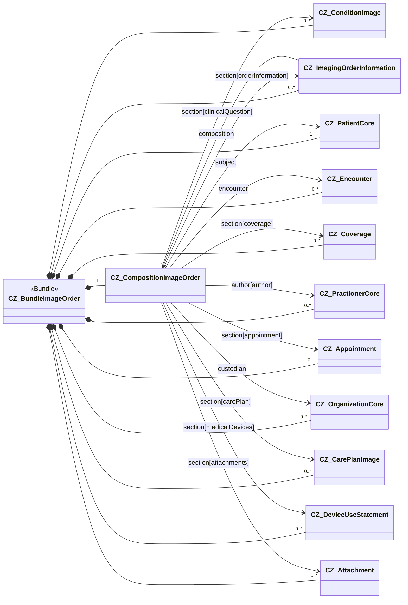

Na následující stránce naleznete poznámky k implementaci obrazové žádanky. Týkají se tvorby kompozice a naplnění tohoto profilu příslušnými daty.

### Přehled

Obrazová žádanka je reprezentována jako FHIR bundle, který obsahuje zdroje CZ_CompositionImageOrder a všechny zdroje ve stromové struktuře zdrojů, na které se odkazovalo (viz [$document operation](https://www.hl7.org/fhir/composition-operation-document.html)).

### Popis obsahu CZ_CompositionImageOrder

