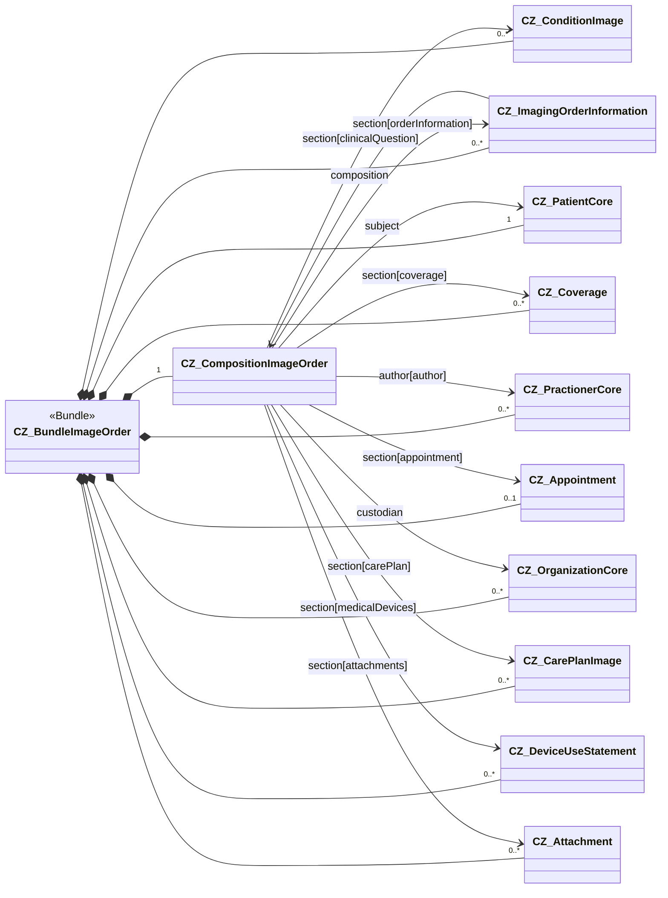

The following page contains notes on implementing the imaging order. They relate to creating the composition and filling this profile with the appropriate data.

### Overview

The order is a FHIR bundle that includes CZ_CompositionImageOrder and all resources in the tree of resources that referred to (see [$document operation](https://www.hl7.org/fhir/composition-operation-document.html)).

### Description of content CZ_CompositionImageOrder

