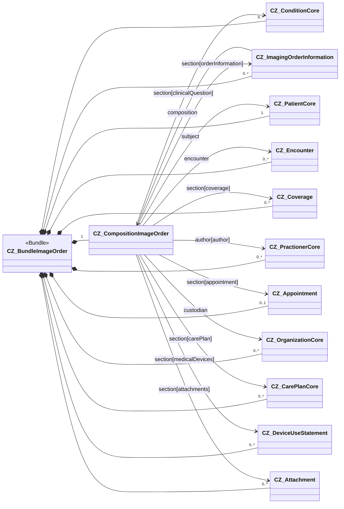

This page contains notes for implementers of the Imaging Order. They concern the assembly of the FHIR Bundle and the population of its profiles with data.

### Overview

The Imaging Order is represented as a FHIR Bundle containing the `CZ_CompositionImageOrder` resource and all resources in the tree of referenced resources, see [$document operation](https://www.hl7.org/fhir/composition-operation-document.html)

```mermaid
classDiagram
  direction LR
  class CZ_BundleImageOrder{
    <<Bundle>>
  }
  CZ_BundleImageOrder *-- "1" CZ_CompositionImageOrder
  CZ_BundleImageOrder *-- "1" CZ_PatientCore
  CZ_BundleImageOrder *-- "0..*" CZ_ImagingOrderInformation
  CZ_BundleImageOrder *-- "0..*" CZ_ConditionCore
  CZ_BundleImageOrder *-- "0..*" CZ_Coverage
  CZ_BundleImageOrder *-- "0..*" CZ_Encounter
  CZ_BundleImageOrder *-- "0..1" CZ_Appointment
  CZ_BundleImageOrder *-- "0..*" CZ_CarePlanCore
  CZ_BundleImageOrder *-- "0..*" CZ_PractionerCore
  CZ_BundleImageOrder *-- "0..*" CZ_OrganizationCore
  CZ_BundleImageOrder *-- "0..*" CZ_DeviceUseStatement
  CZ_BundleImageOrder *-- "0..*" CZ_Attachment

  CZ_ImagingOrderInformation --> CZ_CompositionImageOrder: composition
  
  CZ_CompositionImageOrder --> CZ_ImagingOrderInformation: section[orderInformation]
  CZ_CompositionImageOrder --> CZ_ConditionCore: section[clinicalQuestion]
  CZ_CompositionImageOrder --> CZ_PractionerCore: author[author]
  CZ_CompositionImageOrder --> CZ_Encounter: encounter
  CZ_CompositionImageOrder --> CZ_OrganizationCore: custodian
  CZ_CompositionImageOrder --> CZ_PatientCore: subject
  CZ_CompositionImageOrder --> CZ_Coverage: section[coverage]
  CZ_CompositionImageOrder --> CZ_Appointment: section[appointment]
  CZ_CompositionImageOrder --> CZ_CarePlanCore: section[carePlan]
  CZ_CompositionImageOrder --> CZ_DeviceUseStatement: section[medicalDevices]
  CZ_CompositionImageOrder --> CZ_Attachment: section[attachments]

```

Where no data are available for a required section, the reason is expressed in `composition.section.emptyReason`.

The content of the individual sections and the meaning of the elements are stated on the [Scope and content](scope-and-content.html#conceptual-view) page and in the definitions of the logical models, see [Logical models](logical-models.html). This page does not repeat them.

### Consequences of immutability for assembling the bundle

The bundle is assembled and signed at issue and does not change afterwards, see [Workflow](workflow.html). Immutability is a property of the document, but which data change during processing is determined by the system through which the document is exchanged. The two consequences below therefore apply in the context of the eReferral system, that is the Czech implementation.

1. **Data that change during processing do not belong in the bundle.** If a recommended provider was stated in the element `A.1.6 Requested performer` and the care is eventually provided by another one, the original provider remains in the document. The same applies to the distribution of the result with respect to the element `A.1.7 Additional recipient`.
2. **Content is not supplemented by issuing a new version of the document.** The element `A.2.5 Appointment` carries the date requested or agreed at the time of issue, not the date for which the patient was booked later.

### Identifiers

Three different identifiers appear in and around the document and must be distinguished.

| Identifier | Where it is | What it is for |
|---|---|---|
| `A.2.1.1` Order identifier | in the document, an element of the logical model | Identifies the order in the requester's system. It is assigned by the sending system when the document is assembled. |
| System identifier of the eReferral (`id`, UUID) | outside the document, assigned by the eReferral system on storage | Uniquely identifies the eReferral in the whole ecosystem. Subsequent clinical documents use it to reference the original eReferral. |
| Code of the eReferral (eight alphanumeric characters) | outside the document, assigned by the eReferral system on storage | It is communicated to the patient and serves to present the eReferral to the provider of the requested care. |

Neither the system identifier nor the code is part of the FHIR Bundle, because they do not yet exist at the moment the bundle is assembled and signed.

### Signature of the document

The element `A.1.9 Electronic signatures` carries the electronic signature or seal of the document and the time stamp. The person who wrote the order and the person who signed it are identified in the document by the non-semantic identifier of a healthcare practitioner, and they need not be the same person.

Neither the signing method nor its verification is described in this guide. It follows the general methodology for signing FHIR documents.

### Acceptance with generalisation of the requested examination

The concepts in the [cz-imaging-procedure-vs](ValueSet-cz-imaging-procedure-vs.html) value set are arranged hierarchically, so it can be derived that a requested concept is subsumed by a concept the performing workplace works with, and the request can be accepted. The original coded information and its textual form must remain visible to the performer. The requester's information system must support the whole value set of requested examinations and body parts, offering only a subset at data entry is acceptable.
